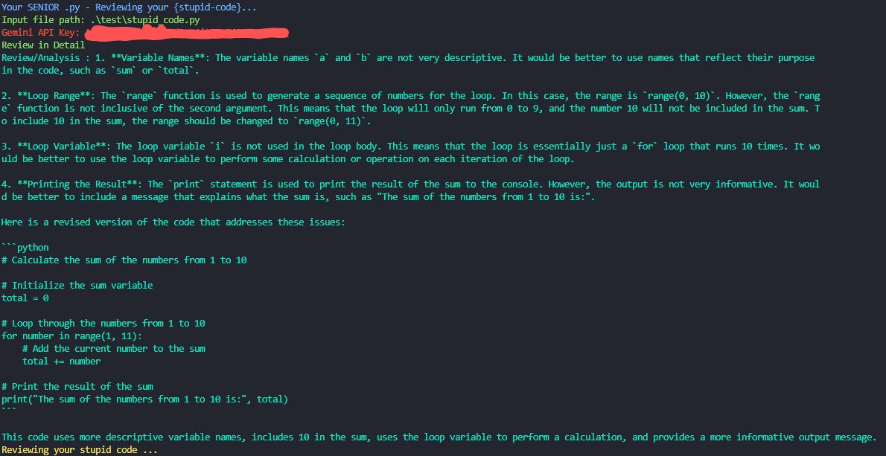

# SeniorDev.ai
<div align="center">
  
  <h1>SeniorDevAI.py</h1>
  
  <h2>Review your stupid code in your terminal only using AI.</h2>
</div>

This is a tool in python for you to review your code 
in none other than your terminal .
You don't have to use any gui just use your terminal like a pro (*hecker)

## About tool
This tool is using google's generative api and python module
To use it you have to first have an api key
from google studio. 

See this [Google's Generative.ai Github](https://github.com/google/generative-ai-python) for more information about them

## Installation 

To install this clone our repo 

`git clone `

You should have Python version around `3.10.9` (it is of my pc)

And then install all dependencies 
by running this command

`pip install requirements.txt`

And run 
` py cli.py --i .\test\stupid_code.py --api [your api-key] -d 1`

To test whether it is running or not 


## How to use 

- Use `--i` flag to give the path of input file . (required).

- Use `--api` flag to give the API-KEY (donot share it and it is required)

- Use `-d` flag in 0 or 1 if you want review in detail or not

- Use `-s` flag in 0 or 1 if you want review in short or not

Final 

``` 
py cli.py --i [path of input file] --api [your api key] -d [1 if you want in detail otherwise leave it] -s[1 if you want in short otherwise leave it] 
```

# Examples 

## Example 1
``` 
py cli.py --i ./test/stupid_code.py --api [your api key] -d 1 
```
```
Your SENIOR .py - Reviewing your {stupid-code}...      
Input file path: .\test\stupid_code.py
Gemini API Key: ******************
Review in Detail
Review/Analysis : 1. **Variable Names**: The variable names `a` and `b` are not very descriptive. It would be better to use names that reflect their purpose 
in the code, such as `sum` or `total`.

2. **Loop Range**: The `range` function is used to generate a sequence of numbers for the loop. In this case, the range is `range(0, 10)`. However, the `range` function is not inclusive of the second argument. This means that the loop will only run from 0 to 9, and the number 10 will not be included in the sum. To include 10 in the sum, the range should be changed to `range(0, 11)`.

3. **Loop Variable**: The loop variable `i` is not used in the loop body. This means that the loop is essentially just a `for` loop that runs 10 times. It would be better to use the loop variable to perform some calculation or operation on each iteration of the loop.

4. **Printing the Result**: The `print` statement is used to print the result of the sum to the console. However, the output is not very informative. It would be better to include a message that explains what the sum is, such as "The sum of the numbers from 1 to 10 is:".

Here is a revised version of the code that addresses these issues:

``python
# Calculate the sum of the numbers from 1 to 10

# Initialize the sum variable
total = 0

# Loop through the numbers from 1 to 10
for number in range(1, 11):
    # Add the current number to the sum
    total += number

# Print the result of the sum
print("The sum of the numbers from 1 to 10 is:", total)
``

This code uses more descriptive variable names, includes 10 in the sum, uses the loop variable to perform a calculation, and provides a more informative output message.
Reviewing your stupid code ...
```

Image 



# Thanks to all contributors!!
